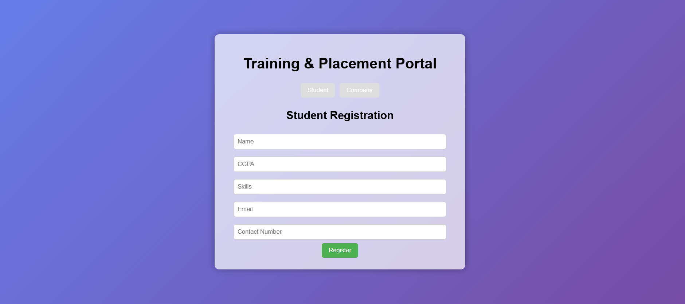
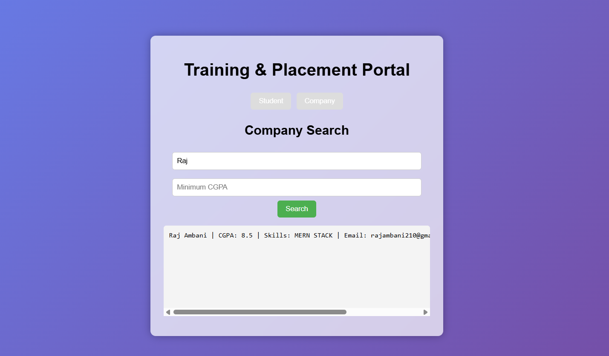
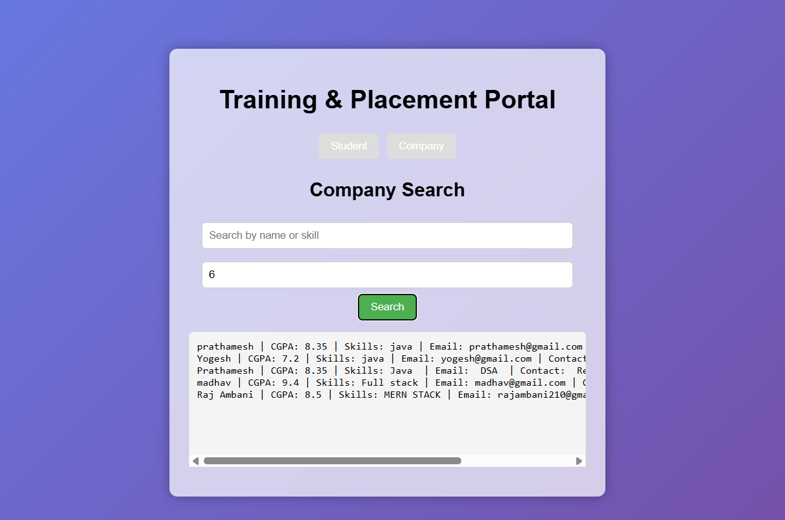

# 🎓 Training & Placement Portal

A full-stack web application that bridges the gap between **students** and **companies** during campus placements. Students can register their profiles (skills, CGPA, contact info), and companies can search for eligible candidates using powerful filters.

---

## 📌 Table of Contents

- [Features](#-features)
- [Tech Stack](#-tech-stack)
- [Architecture](#-architecture)
- [Prerequisites](#-prerequisites)
- [Database Setup](#-database-setup)
- [Running the Application](#-running-the-application)
- [API Endpoints](#-api-endpoints)
- [Project Structure](#-project-structure)
- [Screenshots](#-screenshots)
- [Future Enhancements](#-future-enhancements)
- [License](#-license)

---

## ✨ Features

| Module    | Feature                                                       |
| --------- | ------------------------------------------------------------- |
| 🎓 Student | Register with name, CGPA, skills, email, and contact number  |
| 🏢 Company | Search candidates by **skill/name** keyword                  |
| 🏢 Company | Filter candidates by **minimum CGPA**                        |
| 🏢 Company | Combined search (skill + CGPA) for precise matching          |
| 🌐 General | Glassmorphism UI with gradient background                    |
| 🌐 General | Tab-based navigation between Student and Company views       |
| 🌐 General | CORS-enabled backend for cross-origin requests               |

---

## 🛠 Tech Stack

| Layer      | Technology                          |
| ---------- | ----------------------------------- |
| **Frontend** | React 19, JavaScript, CSS3        |
| **Backend**  | Java (com.sun.net.httpserver)      |
| **Database** | PostgreSQL                         |
| **Driver**   | PostgreSQL JDBC (v42.7.10)         |

---

## 🏗 Architecture

```
┌────────────────────┐         HTTP          ┌─────────────────────┐        JDBC        ┌──────────────────┐
│                    │   GET / POST / OPTIONS │                     │                    │                  │
│   React Frontend   │ ◄──────────────────► │   Java HTTP Server  │ ◄────────────────► │   PostgreSQL DB  │
│   (localhost:3000)  │                      │   (localhost:8080)   │                    │  (placement_db)  │
│                    │                       │                     │                    │                  │
└────────────────────┘                       └─────────────────────┘                    └──────────────────┘
```

- **Frontend** → React SPA served on port `3000`
- **Backend** → Lightweight Java HTTP server on port `8080`
- **Database** → PostgreSQL database `placement_db` on port `5432`

---

## 📋 Prerequisites

Make sure the following are installed on your system:

- **Java JDK** 8 or above → [Download](https://www.oracle.com/java/technologies/downloads/)
- **Node.js** 16+ and npm → [Download](https://nodejs.org/)
- **PostgreSQL** 12+ → [Download](https://www.postgresql.org/download/)

---

## 🗄 Database Setup

1. **Start PostgreSQL** and open `psql` or pgAdmin.

2. **Create the database:**

   ```sql
   CREATE DATABASE placement_db;
   ```

3. **Connect to the database:**

   ```sql
   \c placement_db
   ```

4. **Create the students table:**

   ```sql
   CREATE TABLE students (
       id SERIAL PRIMARY KEY,
       name VARCHAR(100) NOT NULL,
       cgpa DOUBLE PRECISION NOT NULL,
       skills TEXT NOT NULL,
       email VARCHAR(100) NOT NULL,
       contact VARCHAR(20) NOT NULL
   );
   ```

5. **Verify the table was created:**

   ```sql
   \dt
   ```

> **Note:** The backend connects using `postgres` / `postgres123` by default. If your credentials differ, update them in `backend/Server.java` (lines 13–15).

---

## 🚀 Running the Application

### 1. Start the Backend

```bash
cd backend

# Compile the server
javac -cp postgresql-42.7.10.jar Server.java

# Run the server
# On Windows:
java -cp ".;postgresql-42.7.10.jar" Server

# On macOS/Linux:
java -cp ".:postgresql-42.7.10.jar" Server
```

You should see:
```
Backend running on http://localhost:8080 🚀
```

### 2. Start the Frontend

```bash
cd frontend

# Install dependencies (first time only)
npm install

# Start the dev server
npm start
```

The app will open at **http://localhost:3000** in your browser.

---

## 📡 API Endpoints

### `POST /register`

Register a new student.

| Field     | Type   | Description              |
| --------- | ------ | ------------------------ |
| name      | String | Student's full name      |
| cgpa      | Double | CGPA (e.g., 8.5)        |
| skills    | String | Comma-separated skills   |
| email     | String | Email address            |
| contact   | String | Phone number             |

**Request Body** (comma-separated plain text):
```
John Doe,8.5,Java Python React,john@email.com,9876543210
```

**Response:** `200 OK` — `Student Saved`

---

### `GET /students`

Fetch all registered students.

**Response:** `200 OK` — Plain text list of all students.

---

### `GET /search`

Search/filter students.

| Parameter | Type   | Description                        |
| --------- | ------ | ---------------------------------- |
| `skill`   | String | Keyword to match name or skills    |
| `cgpa`    | Double | Minimum CGPA threshold             |

**Examples:**
```
GET /search?skill=java&cgpa=7.5    → students with "java" in skills/name AND cgpa ≥ 7.5
GET /search?skill=react            → students with "react" in skills/name
GET /search?cgpa=8.0               → students with cgpa ≥ 8.0
GET /search?skill=&cgpa=0          → all students
```

**Response:** `200 OK` — Matching students as plain text.

---

## 📁 Project Structure

```
placement_portal/
│
├── README.md                  # Project documentation
│
├── backend/
│   ├── Server.java            # Java HTTP server (API + DB logic)
│   ├── Server.class           # Compiled Java class
│   └── postgresql-42.7.10.jar # PostgreSQL JDBC driver
│
└── frontend/
    ├── package.json           # npm dependencies & scripts
    ├── public/                # Static assets (index.html, icons)
    └── src/
        ├── App.js             # Main React component (UI + logic)
        ├── App.css            # Styles (glassmorphism, layout)
        └── index.js           # React entry point
```

---

## 📸 Screenshots

### Student Registration


### Company Search — All Results


### Company Search — Filtered by Name & CGPA


